# Quest stage milestones

> **Legacy workflow reference.** The product source of truth is
> [`docs/quest/work-chat-system-target.md` §Resolved Quest lifecycle](../quest/work-chat-system-target.md#resolved-quest-lifecycle).
> This file records the earlier stage, Rework, cancellation, dispute, and money
> model. Do not use it to define new behavior.

This document is the earlier stage-by-stage product reference for a Quest. It
describes the historical milestone rules and transitions.

## Roles and participation

- The **Hirer** who creates a Quest is its creator and current owner. A Quest has exactly one current owner; ownership does not transfer in MVP.
- An **accepted participant** is either the current Hirer or a Worker with an active Assignment. Only accepted participants have current Work Conversation membership.
- A Quest has one Hirer and one or more accepted Workers once work participation begins.
- A **Candidate** has applied or formed a team but is not yet an accepted Worker.
- `SOLO` needs one Worker. `GROUP` needs exactly `headcount` Workers before it reaches `ASSIGNED`.
- A Work Conversation has the Hirer and active Workers only. Candidates do not enter it.

## Stage map

```mermaid
stateDiagram-v2
    [*] --> DRAFT
    DRAFT --> OPEN: Hirer locks wage × headcount + platform fee
    OPEN --> OPEN: direct Worker accepted
    OPEN --> ASSIGNED: roster full or candidate/team selected
    ASSIGNED --> IN_PROGRESS: work starts
    IN_PROGRESS --> SUBMITTED: Worker submits proof or confirms no-proof work
    SUBMITTED --> APPROVED: Hirer approves or review window expires
    SUBMITTED --> REWORK: CANDIDATE only; quota remains
    REWORK --> SUBMITTED: Worker resubmits
    APPROVED --> COMPLETED: payment credited

    OPEN --> HIDDEN: Admin moderation
    HIDDEN --> OPEN: Admin restores before startTime
    HIDDEN --> CANCELLED: startTime passes or restore is too late
    OPEN --> CANCELLED: Hirer cancels
    ASSIGNED --> CANCELLED: Hirer cancellation
    IN_PROGRESS --> CANCELLED: Hirer cancellation
    IN_PROGRESS --> DISPUTED
    SUBMITTED --> DISPUTED
    REWORK --> DISPUTED
    DISPUTED --> COMPLETED: Admin awards Worker payment
    DISPUTED --> CANCELLED: Admin refunds Hirer
```

## What each milestone means

| Stage | Meaning | Next milestone |
|---|---|---|
| `DRAFT` | Hirer prepares the Quest. | Hirer locks the total and publishes it. |
| `OPEN` | The Quest is available for direct Workers or Candidate selection. | Roster becomes full, or Hirer/Admin cancels or hides it. |
| `ASSIGNED` | The complete working roster is accepted. | Work starts, or the Hirer cancels. |
| `IN_PROGRESS` | Workers perform the work. | Workers submit, the Hirer cancels, or a party disputes. |
| `SUBMITTED` | Work is awaiting Hirer review. | Approve, rework, or dispute. |
| `REWORK` | Candidate-mode work is being corrected within its declared quota. | Worker resubmits or a party disputes. |
| `APPROVED` | Submitted work passed review. | Credit Worker earnings and complete the Quest. |
| `COMPLETED` | Work and payout are complete. Terminal. | No further Quest stage. |
| `CANCELLED` | The Quest stopped before completion. Terminal. | No further Quest stage. |
| `DISPUTED` | Admin resolves the payment outcome. | Complete or cancel according to the decision. |
| `HIDDEN` | Admin moderation temporarily hides an open Quest; its Quest Escrow remains reserved. | Admin restores it to `OPEN` before `startTime`, or it becomes `CANCELLED` after `startTime`. |

## Acceptance and Work Conversation milestones

- The first accepted Worker creates the Work Conversation; the Hirer joins it at the same time.
- For a direct-join group Quest, later accepted Workers join that same Work Conversation while the Quest can still be `OPEN`.
- When the group reaches exactly `headcount`, the Quest becomes `ASSIGNED`.
- After an Assignment exists, a Worker cannot voluntarily leave. If the Assignment ends through an allowed Hirer cancellation or Admin dispute resolution, the Worker cannot send new content and can read only history from before the terminal transition.
- `COMPLETED` and `CANCELLED` make the Work Conversation read-only. `DISPUTED` does not by itself make it read-only.
- A Quest never reopens in MVP, and its creator/current owner does not change.

## Ownership transition

| Request | MVP result | Work Conversation consequence |
|---|---|---|
| Transfer the Quest to another Hirer | Rejected. No ownership-transfer transition exists. | The original Hirer remains the only Hirer in the room. No new Hirer is added, no existing Hirer is removed, and no membership history is rewritten. |

## Participation and terminal transitions

| Term | Transition | Result |
|---|---|---|
| **Accepted** | A direct Worker joins, or the Hirer selects a Candidate or Candidate team. | Quest creates an `ACTIVE` Assignment. A selected team’s Workers become accepted atomically. The first accepted Worker creates the Work Conversation. |
| **Active** | An accepted Worker has an `ACTIVE` Assignment. | The Worker is a current accepted participant and may use the Work Conversation. |
| **Departed** | An Assignment ends before completion through an allowed Quest or Admin transition. A Worker cannot voluntarily leave after Assignment creation. | Their Assignment becomes `INCOMPLETE` or `CANCELLED`, the Worker leaves the Work Conversation, and may read only history from before departure. |
| **Completed** | All required work is approved, or Admin resolves a dispute for completion. | Active Assignments become `COMPLETED`; the Quest becomes `COMPLETED`; its Work Conversation becomes read-only. |
| **Canceled** | The Hirer cancels at an allowed stage, or an Admin resolves a dispute as a Hirer refund. Workers cannot voluntarily cancel after Assignment creation. | The Quest becomes `CANCELLED`; its Work Conversation becomes read-only and active Assignments become `CANCELLED`. |
| **Reopened** | No transition exists in MVP. | A `COMPLETED` or `CANCELLED` Quest remains terminal; do not create a new Work Conversation or reactivate past Workers. |

## Editing rules

- `OPEN + NO_CANDIDATE`: the Hirer can edit non-core Quest fields before participation. Reward, headcount, mode, participation, and Tag commitments are fixed after publish.
- `OPEN + CANDIDATE`: the Hirer cannot edit any Quest field.
- From `ASSIGNED` onward: the Hirer submits one post-Assignment Quest Edit request. The request snapshots the previous Quest Status and every Active Worker, then moves the Quest to `QUEST_AWAITING_CONSENT`. Only content/details, schedule, nullable label-only locations, and Images are mutable; Mode, Participation, Headcount, Quest Reward, Tag, identity, and Assignment membership are not. Every snapshotted Worker may respond once within five minutes. One rejection or timeout restores the previous Status and discards the proposal. Unanimous approval applies all changes atomically, records linked Quest Edit History, and restores the previous Status. Timeout is an explicit Quest service/worker operation; it is not an API scheduler.

## Quest Image response behavior

- Quest Images are returned in persisted position order in Quest detail and successful image-upload responses. Each returned Quest Image includes its file reference and a viewing link that expires.
- If the server cannot build a viewing link, it logs the failure and returns `502 IMAGE_LINK_FAILED` for the whole response. It does not return a partial list or renumber the remaining positions. The stored file reference remains unchanged.
- Quest Board responses remain text-only and do not include Quest Images.

## Completion, cancellation, and dispute milestones

- The Hirer locks exact integer-Satang Quest Escrow before `QUEST_DRAFT → QUEST_OPEN`: `reward_satang × headcount + Platform Fee` for each required Worker. The Quest records the effective Money Policy revision, Platform Fee basis, Quest Escrow amount, and Funding Reservation. These core funding terms are fixed after publish.
- Proof submissions and proof-free completion confirmations use the same one-hour Proof Review Window in every Quest mode. `NO_CANDIDATE` has no rework; `CANDIDATE` uses the Worker/team’s declared rework limit.
- A proof-free Quest still enters `SUBMITTED`; the Worker submits a completion confirmation instead of a proof file. The confirmation is persisted as a completion obligation (not as a fake Proof Submission), with one obligation per Active Worker or one shared Candidate Team.
- The Quest Lifecycle Worker cancels every `QUEST_OPEN` Quest whose `startTime` has passed before it reaches `ASSIGNED`; it cancels any partial active Assignments and releases the full Quest Escrow.
- Proof HTTP commands are `POST /api/v1/quests/:questId/proof` (multipart images or existing `fileIds`/`imageIds`), `POST .../proof/confirm`, `GET .../proof`, and Hirer `POST .../proof/:proofId/review` with `APPROVE` or `REJECT`. A proof owner is the individual Worker for SOLO and direct GROUP Quests, and the selected Candidate Team for Candidate GROUP Quests.
- Hirer cancellation at `OPEN` returns the full amount. At `ASSIGNED`, return 80% and compensate Workers with 20%. From `IN_PROGRESS` onward, there is no Hirer refund.
- A Worker cannot voluntarily cancel after an Assignment exists. BE-184 implements Hirer cancellation at `OPEN`, `ASSIGNED`, and `IN_PROGRESS`, plus Admin dispute resolution. Worker absence or other failure attribution is outside this scope and does not create a Worker cancellation command.
- In a dispute, Admin may award full Worker payment, full Hirer refund, or a partial split. The Admin command is `POST /api/v1/admin/quests/:questId/dispute/resolve` with a required `Idempotency-Key`; `REFUND_HIRER` releases all remaining Quest Escrow, while `RELEASE_TO_WORKER` accepts explicit positive integer-Satang Worker allocations and returns any remainder to the Hirer. Custom dispute allocations do not invent a Platform Fee; they use the Wallet boundary's zero-fee settlement operation.
- Hirer cancellation is `POST /api/v1/quests/:questId/cancel` with a required `Idempotency-Key`. `QUEST_OPEN` releases the full reservation; `QUEST_ASSIGNED` pays 20% of the reward pool to Active Workers (earliest Assignments receive remainder Satang) and releases the rest; `QUEST_IN_PROGRESS` settles each full Worker Reward plus the snapshotted Platform Fee.

## Candidate applications and Candidate Teams

Candidate applications are available only for `CANDIDATE` + `SOLO` + `QUEST_OPEN` Quests. Candidate application reads and mutations are hidden or rejected after the Quest leaves `QUEST_OPEN`. A Worker can create one application for a Quest and can edit its non-negative `rework_limit` while it is `APPLICATION_APPLIED`. The Worker can withdraw it before selection, changing its status to `APPLICATION_WITHDRAWN`; selection and rejection are later Candidate-selection work.

Candidate Teams are available only for `CANDIDATE` + `GROUP` + `QUEST_OPEN` Quests. Team reads and forming mutations are hidden or rejected after the Quest leaves `QUEST_OPEN`. Team creation adds the leader as its first member. A forming Team Leader can edit the Team name and shared non-negative `rework_limit`, invite Workers, and submit only when the member count equals `headcount`. Submitted Teams are immutable. A Worker can belong to only one Team for a Quest.

Team invitations are persisted with `expires_at = created_at + 24 hours`. API reads do not change an invitation status. Only the scheduled expiry worker changes a pending invitation to `INVITATION_EXPIRED`; accepting a pending invitation whose expiry has passed is rejected without changing the stored status. A pending invitation can be revoked by its Team Leader, or accepted or declined by the invited Worker.

A Member can leave a `TEAM_FORMING` Team; a forming Team Leader can remove another Member, but not themself. When a Leader leaves and Members remain, leadership transfers to the earliest-joined remaining Member (ties broken by user id) and the Team stays `TEAM_FORMING`. When the last Member leaves, the Team becomes `TEAM_DISBANDED`, its pending invitations are revoked, and it stops appearing in Team reads and selection. Disbanded Teams stay stored for audit and do not restore membership.

The HTTP resources are:

- `POST /api/v1/quests/:questId/join` accepts one authenticated Worker on an open `NO_CANDIDATE` Quest. It creates one `ASSIGNMENT_ACTIVE` Assignment. `SOLO` moves to `QUEST_ASSIGNED` immediately; `GROUP` moves when exact headcount is reached. The Quest row is locked while the active roster is counted, so concurrent joins cannot overfill it. Hirers, duplicate Workers, Candidate Quests, and closed or full Quests are rejected. A non-blank `Idempotency-Key` header is required. Missing or whitespace-only values return `400 IDEMPOTENCY_KEY_REQUIRED`. The key is persisted with the actor/request fingerprint and original Assignment/Quest result. A matching retry replays that result; reuse for another request is rejected. The key is passed to the Work Chat transition boundary.
- Direct joins and Candidate selection expose `configureQuestWorkChatMembershipWriter` for the Work Chat adapter. The Work Conversation transition is required: when no writer is configured, or a configured writer fails, the command returns `WORK_CHAT_UNAVAILABLE` and the whole Quest transaction rolls back. No Assignment or selection can commit without the Work Conversation membership transition.
- `POST/GET /api/v1/quests/:questId/applications`, `GET/PATCH/POST .../:applicationId` (read or edit an own application, or withdraw it).
- `POST/GET /api/v1/quests/:questId/teams`, `GET/PATCH .../:teamId`, `GET .../:teamId/members`, `POST .../:teamId/submit`, `POST .../:teamId/leave`, and `DELETE .../:teamId/members/:memberId` (leave a forming Team, or a Leader removing another Member).
- `POST/GET .../:teamId/invitations`, `DELETE .../:invitationId`, plus `GET /api/v1/quests/invitations` and `POST .../:invitationId/{accept,decline}` for the invited Worker.
- Hirers select with `POST /api/v1/quests/:questId/applications/:applicationId/select` for SOLO or `POST /api/v1/quests/:questId/teams/:teamId/select` for GROUP. A non-blank `Idempotency-Key` is required. Selection locks the Quest and candidate roster, marks the winner selected, rejects other submitted/applied Candidates, creates one active Assignment per selected Worker, moves the Quest to `QUEST_ASSIGNED`, and invokes the Work Chat membership writer in the same transaction. A matching retry replays the persisted Assignment result; key reuse conflicts.
