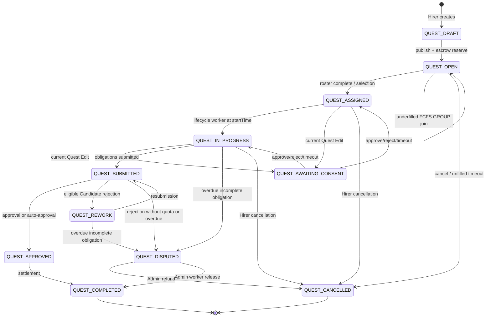
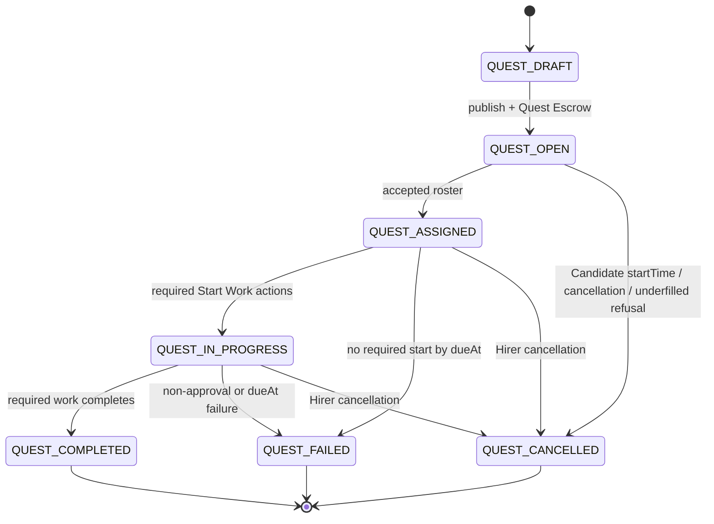
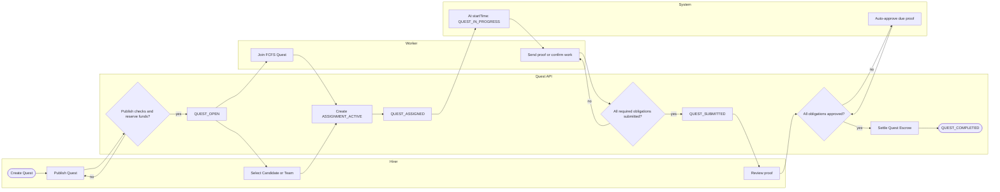

# Quest Lifecycle: Current Implementation and Accepted Target

## Purpose

This guide maps a Quest from creation to its terminal result. It separates the
**current server implementation** from the **accepted product target**. These
are different today.

**Where a Quest starts**

- The persisted lifecycle starts when a Hirer creates `QUEST_DRAFT` with
  `POST /api/v1/quests`.
- The public lifecycle starts when publish creates a Quest Escrow and changes
  `QUEST_DRAFT` to `QUEST_OPEN`.
- Work starts when the lifecycle worker changes an assigned Quest to
  `QUEST_IN_PROGRESS` at `startTime`.

**Current terminal Quest states:** `QUEST_COMPLETED` and `QUEST_CANCELLED`.
`QUEST_DISPUTED` needs an Admin settlement decision.

**Accepted target terminal Quest states:** `QUEST_COMPLETED`,
`QUEST_CANCELLED`, and `QUEST_FAILED`.

The accepted target is not fully shipped. In particular, the repository has no
configured Work Chat membership writer, so Assignment creation fails closed
with `WORK_CHAT_UNAVAILABLE`; no Assignment or state change commits.

## Source status

| Status | Meaning |
| --- | --- |
| **Confirmed** | Documentation and current code agree. |
| **Docs Only** | Documented target or rule; not implemented or not verified in code. |
| **Code Only** | Implemented behavior with no matching accepted-target rule. |
| **Conflict** | Documentation and code, or two documents, define different behavior. |
| **Unclear** | Evidence does not define one behavior. |
| **Not Specified** | The accepted target does not define the rule. |

### Authority

1. `CONTEXT.md` defines domain language.
2. `docs/quest/work-chat-system-target.md` is the accepted target for Quest
   and Chat behavior, and `docs/admin/admin-role.md` is the accepted target
   for Admin behavior. Neither is proof of shipped behavior.
3. Accepted ADRs define architecture decisions.
4. `src/modules/quest/*` and `src/database/schema/quest.schema.ts` define the
   current server behavior.
5. `docs/db/edr/05-quest.sql` documents the current data model, but explicitly
   requires reconciliation to the accepted target.
6. `docs/deprecated/quest-process.md`,
   `docs/deprecated/bpmn-quest-api-comparison.md`, and
   `docs/deprecated/bpmn-current-state-audit.md` are historical evidence.
7. `docs/deprecated/quest-stage-milestones.md` and
   `docs/deprecated/work-chat-contract.md` are legacy references.

The investigation read the Quest, Work Chat, BPMN, EDR, Wallet, and relevant
ADR sources listed in [Sources](#sources). A source is cited at the point where
it changes the behavior described here.

## Actors and responsibilities

| Actor | Responsibility | Current evidence | Target status |
| --- | --- | --- | --- |
| **Hirer** | Creates and publishes the Quest; selects a Candidate or Team; can cancel in implemented allowed states; reviews Proof Submission; writes Reviews. | `quest.service.ts`, `quest-candidate.service.ts`, `quest-settlement.service.ts`, `quest-proof.service.ts`, `quest-review.service.ts` | **Confirmed** except target cancellation and proof rules conflict. |
| **Worker** | Joins an FCFS Quest or becomes a selected Candidate; holds one Assignment per Quest; submits proof or confirms proof-free work; writes a Review. | `quest-assignment.service.ts`, `quest-candidate.service.ts`, `quest-proof.service.ts` | **Confirmed** for current paths. |
| **Candidate** | Applies to a Candidate Quest or forms a Candidate Team. A Candidate is not a Worker before Assignment creation. | `quest-candidate.service.ts`; `CONTEXT.md` | **Confirmed**. |
| **Prospective Worker** | Can open one Candidate Inquiry Conversation with the Hirer while the Quest is open. | `work-chat-system-target.md` §Candidate Inquiry Conversation | **Docs Only**; no target Chat module exists. |
| **Quest Board** | Lists published open Quests for discovery. | `quest.route.ts`, `quest.service.ts` | **Confirmed**. |
| **Quest lifecycle worker** | Starts due assigned Quests, cancels unfilled open Quests, disputes overdue incomplete Quests, expires Team Invitations and Quest Edit requests, and auto-approves due proof. | `quest-lifecycle.worker.ts` | **Code Only** where it conflicts with the target. |
| **Work Chat writer** | Creates or updates Work Conversation membership in the same transaction as Assignment and terminal transitions. | `quest-work-chat.contract.ts`; ADR `0005-quest-owns-work-chat-membership.md` | **Conflict**: architecture is confirmed, but no runtime writer is configured. |
| **Wallet / Quest Escrow** | Reserves Hirer Spending Balance at publish, then releases or settles funds. Wallet owns ledger facts; Quest owns when to call it. | `quest.publish.policy.ts`, `quest-settlement.service.ts`, `wallet.funding.service.ts`; ADR `0009-keep-money-independent-of-quest-model.md` | **Confirmed** for the current reservation seam. |
| **Admin** | Resolves an implemented `QUEST_DISPUTED` to refund Hirer or release money to Workers. | `quest-settlement.service.ts`, `quest-settlement.route.ts` | **Conflict**: the accepted target has no `QUEST_DISPUTED` branch. |
| **System / KU bot** | Runs lifecycle jobs. The target also creates System Messages, Push delivery, audit records, and Admin Review Items. | `quest-lifecycle.worker.ts`; target §§System Message, Push, Audit | Jobs **Confirmed**; Chat, Push, audit, and Admin Review Item are **Docs Only**. |

## Current state transitions

This table is the shipped server model. A transition marked *blocked at runtime*
cannot commit until a Work Chat membership writer is configured.

| From | Trigger and guard | To | Assignment / money result | Status |
| --- | --- | --- | --- | --- |
| — | Hirer creates a Quest. | `QUEST_DRAFT` | No Quest Escrow. | **Confirmed** — `quest.service.ts#createQuest`. |
| `QUEST_DRAFT` | Hirer publishes. Publish requires a Tag, future `startTime`, `dueAt` after `startTime`, positive Reward, valid headcount, and enough active Wallet Spending Balance. | `QUEST_OPEN` | Reserves Quest Escrow and snapshots money policy. | **Confirmed** — `quest.service.ts#publishQuest`, `quest.publish.policy.ts`. |
| `QUEST_OPEN` | FCFS Worker joins; `SOLO` completes immediately. Candidate Hirer selects one application or submitted full Team. | `QUEST_ASSIGNED` | Creates `ASSIGNMENT_ACTIVE`; atomic Work Chat transition is required. | **Confirmed in code; blocked at runtime** — `quest-assignment.service.ts#joinNoCandidateQuest`, `quest-candidate.service.ts#selectCandidate`; `bpmn-quest-api-comparison.md` §3. |
| `QUEST_OPEN` | Additional FCFS `GROUP` Workers join before exact `headcount`. | `QUEST_OPEN` | Creates an active Assignment and requests Work Chat membership. | **Confirmed in code; blocked at runtime**. |
| `QUEST_ASSIGNED` | Lifecycle worker sees `startTime <= now`. | `QUEST_IN_PROGRESS` | Sets `startedAt` for active Assignments. | **Code Only** — `quest-lifecycle.worker.ts#startQuest`. |
| `QUEST_ASSIGNED` or `QUEST_IN_PROGRESS` | Hirer submits a current Quest Edit request. Non-core fields only; active Workers must respond. | `QUEST_AWAITING_CONSENT` | No money change. | **Code Only / Conflict** — `quest.service.ts#createQuestEditRequest`. |
| `QUEST_AWAITING_CONSENT` | Every snapshotted Worker approves. Any rejection or timeout restores the prior Quest state. | Prior state | Writes edit history only if approved. | **Code Only / Conflict** — five-minute implementation window. |
| `QUEST_IN_PROGRESS` or `QUEST_REWORK` | Every required proof or proof-free confirmation is submitted. | `QUEST_SUBMITTED` | Proof becomes `PROOF_PENDING`, or completion confirmation is stored. | **Confirmed for current model** — `quest-proof.service.ts`. |
| `QUEST_SUBMITTED` | Hirer approves each proof, or the current auto-approval worker resolves due pending proof or proof-free confirmations. | `QUEST_APPROVED` then `QUEST_COMPLETED` | Settles approved Quest Escrow to Workers and Platform Fee revenue. | **Confirmed for current model** — `quest-proof.service.ts`, `quest-settlement.service.ts`. |
| `QUEST_SUBMITTED` | Hirer rejects proof for a Candidate Quest while the declared rework quota remains. | `QUEST_REWORK` | Rejected proof is stored. | **Code Only / Conflict** — target forbids Rework. |
| `QUEST_SUBMITTED` or `QUEST_REWORK` | Hirer rejects without available rework quota. | `QUEST_DISPUTED` | Escrow remains reserved. | **Code Only / Conflict**. |
| `QUEST_IN_PROGRESS`, `QUEST_SUBMITTED`, or `QUEST_REWORK` | Lifecycle worker reaches `dueAt` and a required obligation is incomplete. | `QUEST_DISPUTED` | Escrow remains reserved. | **Code Only / Conflict** — `quest-lifecycle.worker.ts#disputeQuest`. |
| `QUEST_OPEN` | Hirer cancels, or worker auto-cancels an unfilled Quest when `startTime` passes. | `QUEST_CANCELLED` | Releases all remaining Quest Escrow to Hirer. | **Confirmed** — `quest-settlement.service.ts#cancelQuest`. |
| `QUEST_ASSIGNED` | Hirer cancels. | `QUEST_CANCELLED` | Pays 20% of the reward pool to active Workers; returns 80% and Platform Fee to Hirer. | **Confirmed**. |
| `QUEST_IN_PROGRESS` | Hirer cancels. | `QUEST_CANCELLED` | Pays full Worker Rewards and Platform Fee; no Hirer refund. | **Confirmed**. |
| `QUEST_DISPUTED` | Enabled Admin resolves with `REFUND_HIRER` or `RELEASE_TO_WORKER`; an `Idempotency-Key` is required. | `QUEST_CANCELLED` or `QUEST_COMPLETED` | Refunds remaining funds, or allocates explicit positive satang amounts to Workers and returns the remainder. | **Confirmed for current model**. |
| `QUEST_HIDDEN` | No route or service transition exists. The schema has fields for it. | — | No verified runtime behavior. | **Code Only / Unclear**. |

### Current state machine



`QUEST_AWAITING_CONSENT` returns to the request's recorded prior state; the
arrows in the diagram show both possible prior states.

## Accepted target lifecycle

`docs/quest/work-chat-system-target.md` §Resolved Quest lifecycle is the
product source of truth. The target removes `QUEST_AWAITING_CONSENT`,
`QUEST_SUBMITTED`, `QUEST_APPROVED`, `QUEST_REWORK`, `QUEST_DISPUTED`, and
`QUEST_HIDDEN` from the Quest state set.

| From | Event | To | Assignment result | Status |
| --- | --- | --- | --- | --- |
| — | Hirer creates a Quest with one or more Condition Items. | `QUEST_DRAFT` | None. | **Docs Only**. |
| `QUEST_DRAFT` | Hirer publishes after setting `dueAt` and funding the inclusive Quest Funding Total through Quest Escrow. | `QUEST_OPEN` | None. | **Docs Only**. |
| `QUEST_OPEN` | FCFS roster reaches `headcount`, Hirer selects a Candidate roster, or every current underfilled FCFS Worker consents. | `QUEST_ASSIGNED` | Selected Workers become `ASSIGNMENT_ACTIVE`; the underfilled original `headcount` remains published. | **Docs Only**. |
| `QUEST_ASSIGNED` | Required starter presses Start Work between `startTime` and `dueAt`. Full and underfilled `GROUP + FCFS` require every Active Worker; `GROUP + CANDIDATE` requires Team Leader. | `QUEST_IN_PROGRESS` | Assignment acceptance is the only general pre-start consent. | **Docs Only**. |
| `QUEST_IN_PROGRESS` | Required work completes: each Worker for `GROUP + FCFS`, or Team Leader for `GROUP + CANDIDATE`. | `QUEST_COMPLETED` | Approved or proof-free Candidate Team work completes every Active Worker Assignment. | **Docs Only**. |
| `QUEST_ASSIGNED` or `QUEST_IN_PROGRESS` | Required Start Work action, proof, or proof-free confirmation is missing at `dueAt`; or Hirer does not approve proof. | `QUEST_FAILED` | A failed Candidate Team work result makes every Active Worker Assignment incomplete; otherwise the affected Assignment is incomplete. No Rework. | **Docs Only**. |
| `QUEST_OPEN` | Candidate Quest is still open at `startTime`; Hirer cancels; or underfilled FCFS decision, consent, or timeout cancels. | `QUEST_CANCELLED` | Candidate Quest has no accepted roster. | **Docs Only**. |
| `QUEST_ASSIGNED` or `QUEST_IN_PROGRESS` | Hirer cancellation. | `QUEST_CANCELLED` | Assigned pays 20% reward pool to Active Workers; in-progress settles full Rewards and Platform Fee. | **Docs Only**. |
| terminal | No reopen. | — | Work Conversation is Member read-only; Review can begin. | **Docs Only**. |

### Accepted-target state machine



## Happy path: current server

This is the current normal path. Assignment steps require the missing Work Chat
writer to be configured first.

1. A Hirer creates `QUEST_DRAFT`.
2. The Hirer publishes. The server creates a Wallet Funding Reservation for the
   Quest Reward pool and Platform Fee, then makes the Quest `QUEST_OPEN`.
3. A Worker joins an FCFS Quest, or the Hirer selects a Candidate or Team. The
   server creates active Assignments and moves a complete roster to
   `QUEST_ASSIGNED`.
4. At `startTime`, the lifecycle worker moves the Quest to
   `QUEST_IN_PROGRESS`.
5. Required Workers submit proof or a proof-free completion confirmation. When
   all current obligations exist, the Quest becomes `QUEST_SUBMITTED`.
6. The Hirer approves each Proof Submission. The lifecycle worker resolves due
   pending proof and proof-free confirmations, then the server settles funds
   and reaches `QUEST_COMPLETED`.
7. The Hirer and completed Workers can create one Review in each direction for
   seven days after completion. Reviews cannot be deleted.

### Sequence diagram: current happy path

```mermaid
sequenceDiagram
    participant H as Hirer
    participant Q as Quest API
    participant W as Wallet
    participant R as Worker
    participant C as Work Chat writer
    participant L as Lifecycle worker

    H->>Q: Create Quest
    Q-->>H: QUEST_DRAFT
    H->>Q: Publish Quest
    Q->>W: Reserve Quest Escrow
    W-->>Q: Funding Reservation
    Q-->>H: QUEST_OPEN
    R->>Q: Join or become selected
    Q->>C: Apply membership transition
    Note over Q,C: Current composition has no writer; without one this rolls back.
    C-->>Q: Membership written
    Q-->>R: ASSIGNMENT_ACTIVE / QUEST_ASSIGNED
    L->>Q: startTime reached
    Q-->>R: QUEST_IN_PROGRESS
    R->>Q: Send proof or completion confirmation
    H->>Q: Approve proof
    Q->>W: Settle Quest Escrow
    W-->>Q: Settlement complete
    Q-->>H: QUEST_COMPLETED
    Q-->>R: QUEST_COMPLETED
```

### BPMN-style view: current server



## Policies and business rules

### Current implemented rules

| Policy / rule | Condition | Result | Source | Status |
| --- | --- | --- | --- | --- |
| Publish time | `startTime` must be future; `dueAt > startTime`. | Publish fails otherwise. | `quest.publish.policy.ts` | **Confirmed**. |
| Reward and headcount | API Reward is ฿1–฿700,000; headcount is 1–20. Stored money uses integer satang. | Escrow uses the reward, fee, and headcount. | `quest.schema.ts`, `quest.publish.policy.ts`, ADR `0005-integer-satang-for-money.md` | **Confirmed**. |
| Platform Fee | Default active policy is 200 basis points; rounding mode is up. | Hirer funds Reward plus fee. | `quest.publish.policy.ts`, Wallet schema | **Confirmed**. |
| Quest Escrow | Publication reserves `(reward + rounded per-worker fee) × headcount`. | The reservation is a generic Wallet Funding Reservation with `callerScope: 'quest'`. | `quest.publish.policy.ts`, `wallet.funding.service.ts`, ADR `0009-keep-money-independent-of-quest-model.md` | **Confirmed**. |
| FCFS join and selection retry | A non-blank `Idempotency-Key` is required. | Matching retry replays result; a reused key for another request conflicts. | `quest-assignment.service.ts`, `quest-candidate.service.ts` | **Confirmed**. |
| Candidate Team invitation | Pending invitation expires after 24 hours. | Lifecycle worker sets `INVITATION_EXPIRED`; reads do not alter it. | `quest-candidate.service.ts`, `quest-lifecycle.worker.ts` | **Confirmed**. |
| Current Quest Edit | Hirer edits non-core fields from `QUEST_ASSIGNED` or `QUEST_IN_PROGRESS`; every active Worker responds once. | Quest pauses in `QUEST_AWAITING_CONSENT`; any rejection or five-minute timeout restores prior state. | `quest.service.ts` | **Confirmed**, but **Conflict** with target. |
| Proof limit | Current proof accepts at most three images. | Larger proof is rejected. | `quest-proof.service.ts` | **Confirmed**, but **Conflict** with target five-file rule. |
| Proof decision timeout | Current auto-approval is one hour after the review condition. | Pending proof can become auto-approved. | `quest-proof.service.ts`, `quest-lifecycle.worker.ts` | **Confirmed**, but **Conflict** with target 24-hour rule. |
| Rework | Candidate rejection can use declared rework quota. | Quest becomes `QUEST_REWORK`; resubmission is permitted. | `quest-proof.service.ts`, `quest.contract.ts` | **Confirmed**, but **Conflict** with target. |
| Overdue work | A required proof or confirmation is incomplete at `dueAt`. | Lifecycle worker moves the Quest to `QUEST_DISPUTED`. | `quest-lifecycle.worker.ts` | **Confirmed**, but **Conflict** with target `QUEST_FAILED`. |
| Hirer cancellation: open | Hirer cancels `QUEST_OPEN`, or unfilled open Quest reaches `startTime`. | Full remaining Quest Escrow returns to Hirer. | `quest-settlement.service.ts` | **Confirmed**. |
| Hirer cancellation: assigned | Hirer cancels `QUEST_ASSIGNED`. | 20% reward pool goes to active Workers; 80% and fee return to Hirer. | `quest-settlement.service.ts`, `quest-settlement.integration.test.ts` | **Confirmed**. |
| Hirer cancellation: in progress | Hirer cancels `QUEST_IN_PROGRESS`. | Full Worker Rewards and Platform Fee settle; no Hirer refund. | `quest-settlement.service.ts`, `quest-settlement.integration.test.ts` | **Confirmed**. |
| Worker leave / reassignment | An Assignment is active. | No current route or worker transition permits voluntary leave, replacement, or reassignment. | `quest-assignment.route.ts`, `quest-settlement.service.ts` | **Confirmed** — target has the same rule. |
| Admin dispute decision | Quest is `QUEST_DISPUTED`; enabled Admin sends idempotent decision. | `REFUND_HIRER` → cancelled; `RELEASE_TO_WORKER` → completed with explicit satang allocations. | `quest-settlement.service.ts` | **Confirmed**, but **Conflict** with target. |
| Review | Quest is completed; author is Hirer or a completed Worker. | One Review each direction; editable for seven days after completion; deletion rejected. | `quest-review.service.ts` | **Confirmed**, but **Conflict** with target terminal-state scope. |
| Quest hiding | Schema has `hiddenAt` and `hiddenByAdminId`. | No shipped hide or restore command. | `quest.schema.ts`, `quest.service.ts`, `quest.route.ts` | **Code Only / Unclear**. |

### Accepted target rules not yet implemented

| Policy / rule | Condition | Result | Source | Status |
| --- | --- | --- | --- | --- |
| `dueAt` | Must be set before publish; Asia/Bangkok; server time decides; immutable after `QUEST_ASSIGNED`. | Late required actions are rejected. | `work-chat-system-target.md` §§Value constraints, Due time | **Docs Only**. |
| Due reminders | Active Worker has not completed required action. | Reminder at 24 hours and one hour before `dueAt`; past reminder is skipped. | Target §Due time | **Docs Only**. |
| Quest Condition | At least one ordered, trimmed, non-empty Item of at most 255 characters. | Hirer may edit only in `QUEST_ASSIGNED`. | Target §Quest Condition | **Docs Only**. |
| Target Quest Edit | Hirer submits one request only in `QUEST_ASSIGNED`. | All Active Workers have 10 minutes; all accept applies it, any decline/timeout/leave fails it; no Quest pause state. | Target §Edit protocol | **Docs Only / Conflict**. |
| Start Work | Required starter acts from `startTime` through `dueAt`: Worker for SINGLE, Team Leader for Candidate GROUP, every Active Worker for FCFS GROUP. | All required starts move Quest to `QUEST_IN_PROGRESS`; a missing start at `dueAt` fails the Quest. Assignment acceptance is the only general pre-start consent. | Target §Resolved Quest lifecycle | **Docs Only / Conflict**. |
| Underfilled FCFS GROUP | At `startTime`, Active Worker count is below published `headcount`. | Hirer has 10 minutes to choose; proceed needs every current Active Worker's consent within 10 minutes. All consent changes open to assigned; each Worker still starts by `dueAt`. No choice, decline, or timeout cancels. | Target §Resolved Quest lifecycle | **Docs Only**. |
| Underfilled Reward | Hirer proceeds with smaller FCFS GROUP roster. | Consent shows exact new Reward and `dueAt`; original Worker Reward pool is split equally; earliest accepted Worker receives remainder satang; roster freezes when started. | Target §Resolved Quest lifecycle | **Docs Only**. |
| Candidate Team | `GROUP + CANDIDATE` Quest is open. | Server Join Code is valid for 24 hours and may be regenerated. Eligible Prospective Workers form one Team per Quest; leader submits exact-headcount Team; selection rejects all other Candidates atomically. | Target §Resolved Quest lifecycle | **Docs Only / Conflict**. |
| Proof submitter | Proof is required. | Worker submits for SINGLE and FCFS GROUP; Team Leader submits Team work for Candidate GROUP. | Target §Resolved Quest lifecycle | **Docs Only / Conflict**. |
| Target proof decision | Hirer decides a pending proof. | First decision wins. `PROOF_NOT_APPROVED` needs a reason ≤1,000 chars. | Target §Review and decision | **Docs Only**. |
| Target proof timeout | A proof stays pending for 24 hours after send. | System uses `PROOF_APPROVED`; it never changes an earlier decision. | Target §Review and decision | **Docs Only / Conflict**. |
| Inclusive Quest Funding Total | A Hirer sets ฿1–฿700,000 for each published Worker slot; headcount is 1–20. | The total contains the net Quest Reward and Platform Fee. The Server chooses the greatest Reward whose required fee fits; any rounding remainder stays in the fee. Quest Escrow reserves the exact integer-satang total for every published headcount slot. | Target §Reward and money contract; ADR `0024-inclusive-quest-funding-total.md` | **Docs Only**. |
| Target failure | Required start, proof, or proof-free confirmation is missing at `dueAt`, or proof is not approved. | Quest becomes terminal `QUEST_FAILED`; no Rework or second proof. Failed Candidate Team work makes every Active Worker Assignment incomplete; other failure affects its required Assignment. | Target §Resolved Quest lifecycle; ADR `0016-not-approved-proof-fails-quest.md` | **Docs Only / Conflict**. |
| GROUP completion | Required GROUP work completes. | A completed FCFS Worker keeps Reward if another Assignment fails. Approved or proof-free Candidate Team work completes every Active Worker Assignment. | Target §Resolved Quest lifecycle | **Docs Only**. |
| Target cancellation settlement | Hirer cancels open, assigned, or in-progress Quest. | Open refunds Hirer; assigned pays 20% reward pool to Active Workers; in-progress settles full Rewards and Platform Fee. | Target §Resolved Quest lifecycle | **Docs Only**. |
| Worker departure | Assignment is active. | No voluntary leave or reassignment. | Target §Resolved Quest lifecycle | **Docs Only**. |
| Dispute Case | Quest failed. | May exist without reopening or changing the Quest State. Actors, 1-day self-file and 5-day Admin windows, shared per-Quest cap, and a 7-day money hold are defined. | `CONTEXT.md`; `docs/admin/admin-role.md` §2; ADR `0024-hold-quest-failure-settlement-for-dispute-window.md` | **Docs Only**. |
| Reward transfer failure | Assignment is completed but transfer fails. | Transfer stays pending and retries with no duplicate or reclaim. | Target §Reward and money contract | **Docs Only**. |
| Reviews after terminal result | Quest is completed, cancelled, or failed. | Each Hirer/Worker direction is available once; author can edit for seven days; no delete. | `CONTEXT.md`; target §Rating Review | **Docs Only / Conflict**. |
| Quest Image v2 | A Hirer manages zero to three optional images on an owned `QUEST_DRAFT`. | `POST /api/v2/quests/:questId/images` appends a validated JPEG, PNG, or WebP up to 5 MB; `DELETE /api/v2/quests/:questId/images/:imageId` soft-deletes one image and repacks positions. Both writes are idempotent, and images are immutable after publish in this contract. | `CONTEXT.md`; target §Quest Image contract; ADR `0025-quest-image-v2-contract.md` | **Docs Only**. |
| Candidate Inquiry Conversation | Viewable `QUEST_OPEN` Quest and one Hirer/Prospective Worker pair. | One private inquiry; closes irreversibly at Assignment, assignment-complete state change, or pre-assignment cancellation. | Target §Candidate Inquiry Conversation; ADR `0019-separate-candidate-inquiry-conversation.md` | **Docs Only**. |
| Work Conversation | First active Assignment. | One conversation; Hirer and Active Workers only; terminal Quest is Member read-only. | Target §Work Conversation; ADR `0005-quest-owns-work-chat-membership.md` | **Docs Only**. |
| Message rate limit | Per Member per Quest. | At most 30 Messages and 10 Attachments per minute. | Target §Rate limits | **Docs Only**. |
| System and Push | Quest or membership event. | Target defines immutable System Messages and Android-only direct FCM delivery with idempotent retries. | Target §§System Message, Push; ADRs `0017`, `0018` | **Docs Only**. |
| Audit and retention | Quest reaches terminal state. | Audit records are retained at least one year; Report Case hold can extend retention. | Target §Audit and retention; ADR `0015-work-chat-retention-and-account-deletion.md` | **Docs Only**; one-year period awaits university-policy confirmation. |

## Alternative flows

| Flow | Current implementation | Accepted target |
| **FCFS GROUP stays underfilled** | Lifecycle worker cancels at `startTime`. | Hirer has 10 minutes to proceed or cancel. Proceed needs every current Active Worker's 10-minute consent; all consent changes open to assigned, then every Worker still starts by `dueAt`. Otherwise Quest cancels. **Conflict**. |
| **Candidate Team formation** | Targeted in-app invitations expire after 24 hours; complete Team needs leader submission before Hirer selection. | Server Join Codes admit eligible Prospective Workers to one forming Team per Quest. Regeneration invalidates the old code; leader submits exact `headcount`; selection rejects all other Candidates atomically. **Conflict**. |
| **Candidate Quest starts unselected** | Lifecycle worker cancels unfilled open Quest at `startTime`. | An open Candidate Quest at `startTime` cancels. **Current code and target agree on result; Candidate Team lifecycle differs.** |
| **Cancellation** | Hirer may cancel only open, assigned, or in-progress Quest. Exact settlement depends on state. | Same three states and exact state-based settlement. **Current code and target agree on this branch.** |
| **Proof-free work** | Every required confirmation moves current Quest through submitted/approval/settlement handling. | Required submitter confirms directly; no Hirer review. Candidate Team confirmation completes every Active Worker Assignment. **Conflict**. |
| **Proof rejection** | Candidate rework or dispute. | Immediate terminal failure and Admin Review Item; no Rework. **Conflict**. |
| **Overdue start, proof, or confirmation** | Missing proof/confirmation moves to `QUEST_DISPUTED`; no Start Work action exists. | Missing required action at `dueAt` moves to `QUEST_FAILED`. **Conflict**. |
| **Admin intervention** | Admin resolves `QUEST_DISPUTED`. | A Dispute Case opens after `QUEST_FAILED` and redirects part of the held settlement to a Worker (`docs/admin/admin-role.md` §2). Admin Review Item remains audit only. **Conflict**. |
| **Payment failure** | Wallet settlement is internal and current Quest settlement has no target Reward Transfer status machine. | Pending transfer retries idempotently without duplicate payment. Provider execution is out of scope. |
| **Worker departure or reassignment** | No voluntary departure or reassignment path. | Same rule. **Current code and target agree on absence.** |
| **Terminal work access** | Current Work Chat writer is not configured. | Conversation is read-only for Members; system may append later System Messages. **Docs Only**. |

## Docs versus code gaps

| Area | Documentation | Code | Classification |
| --- | --- | --- | --- |
| Quest state set | Target has seven Quest states and terminal `QUEST_FAILED`. | Current contract has twelve states, including `QUEST_AWAITING_CONSENT`, `QUEST_SUBMITTED`, `QUEST_APPROVED`, `QUEST_REWORK`, `QUEST_DISPUTED`, and `QUEST_HIDDEN`; it lacks `QUEST_FAILED`. | **Conflict** — target §§State naming, Known conflicts; `quest.contract.ts`. |
| Proof statuses | Target uses `PROOF_PENDING`, `PROOF_APPROVED`, `PROOF_NOT_APPROVED`. | Current code uses `PROOF_REJECTED` and `PROOF_AUTO_APPROVED`. | **Conflict** — target §§State naming, Known conflicts; `quest.contract.ts`. |
| Failure and Rework | Target failure is terminal and has no Rework. | Current Candidate proof rejection can create `QUEST_REWORK`; other rejection or overdue work creates `QUEST_DISPUTED`. | **Conflict** — ADR `0016`; `quest-proof.service.ts`, `quest-lifecycle.worker.ts`. |
| Quest Edit | Target: only assigned, Condition Item change, ten-minute all-worker protocol, no Quest pause. | Current: assigned or in-progress, broader allowed fields, five-minute protocol, `QUEST_AWAITING_CONSENT`. | **Conflict** — target §Edit protocol; `quest.service.ts`. |
| Completion / Review | Target opens Review after completed, cancelled, or failed Quest. | Current review requires completed Quest and completed Assignment. | **Conflict** — `CONTEXT.md`; `quest-review.service.ts`. |
| Candidate Inquiry and Work Chat | Target requires inquiry lifecycle, Chat, membership, Push, and System Messages. | No target Chat module; no configured membership writer, so Assignment commands fail closed. | **Docs Only** for target / **runtime gap** — target §Known conflicts; `bpmn-quest-api-comparison.md` §3. |
| Target proof shape | Target permits file-only proof, up to five files, and 24-hour approval. | Current proof schema requires content, permits three images, and uses one-hour auto-approval. | **Conflict** — target §Known conflicts; `quest-proof.service.ts`. |
| Candidate GROUP submitter | Target requires Team Leader submission and Team-level Assignment completion or failure. | Current selected Team member can submit on behalf of the Team. | **Conflict** — target §Resolved Quest lifecycle; `quest-proof.service.ts`. |
| Team onboarding | Target specifies Server Join Codes and Team lifecycle rules. | Current code implements 24-hour targeted invitations. | **Conflict** — target §Resolved Quest lifecycle; `quest-candidate.service.ts`. |
| Pre-start consent and deadline extension | Target has no general pre-start consent and keeps `dueAt` immutable after assignment. | Current `QUEST_AWAITING_CONSENT` is only post-Assignment Quest Edit consent. | **Conflict** — target §Resolved Quest lifecycle; `quest.service.ts`. |
| Dispute and hide | Target has neither `QUEST_DISPUTED` nor `QUEST_HIDDEN`. A Dispute Case acts on `QUEST_FAILED`, and hiding is the independent `hiddenAt` flag (`docs/admin/admin-role.md` §§2–3). | Legacy/EDR still define both states; current dispute settlement uses `QUEST_DISPUTED`; hide fields exist but no commands. | **Conflict** — both enum values must go. |
| Report Case and moderation | `CONTEXT.md` and `docs/admin/admin-role.md` §5 define Report Cases, Admin evidence access, and the moderation decisions. | No Report Case, Reporter Entry, Moderation Decision, Evidence Reference, or Admin Review Item model exists. | **Docs Only**. |

## Remaining non-lifecycle policies

| Policy | Evidence | Status |
| --- | --- | --- |
| Dispute Case | A Failed Quest may have a Dispute Case. | Defined in `docs/admin/admin-role.md` §2: actors, deadlines, shared per-Quest cap, and the 7-day money hold (ADR `0024`). **Docs Only**. |
| Member account ban or suspension | `auth_user` has no ban model, route, or policy yet. Wallet status is a separate concept. | Defined in `docs/admin/admin-role.md` §6: two penalty ladders, Red Flag, and the `memberPenaltyRecord` audit table. **Docs Only**. |
| Admin Quest moderation | Legacy/EDR describe `QUEST_HIDDEN`; code has fields but no operation. | Defined in `docs/admin/admin-role.md` §3: `hiddenAt` is an independent flag and adds no Quest State. **Docs Only**. |
| Production retention period | ADR `0015` requires university-policy confirmation. | ⚠️ **NOT SPECIFIED** |

## Sources

### Canonical and accepted sources

- `CONTEXT.md`
- `docs/quest/work-chat-system-target.md`
- `docs/admin/admin-role.md`
- `docs/adr/0005-quest-owns-work-chat-membership.md`
- `docs/adr/0015-work-chat-retention-and-account-deletion.md`
- `docs/adr/0016-not-approved-proof-fails-quest.md`
- `docs/adr/0017-android-only-push-notifications.md`
- `docs/adr/0018-send-android-push-directly-to-fcm.md`
- `docs/adr/0019-separate-candidate-inquiry-conversation.md`
- `docs/adr/0005-integer-satang-for-money.md`
- `docs/adr/0006-ledger-is-financial-source-of-truth.md`
- `docs/adr/0007-money-behavior-lives-behind-services.md`
- `docs/adr/0009-keep-money-independent-of-quest-model.md`
- `docs/adr/0010-retain-and-correct-financial-records.md`
- `docs/adr/0012-wallet-ledger-is-a-subledger.md`
- `docs/adr/0013-work-chat-rest-authoritative-delivery.md`
- `docs/adr/0014-work-chat-is-server-readable-for-moderation.md`
- `docs/adr/0021-keep-escrow-during-moderation-hide.md`
- `docs/adr/0022-manual-admin-approval-for-payouts.md`
- `docs/adr/0024-hold-quest-failure-settlement-for-dispute-window.md`

### Current, draft, comparison, and legacy sources

- `src/database/schema/quest.schema.ts`
- `src/modules/quest/quest.contract.ts`
- `src/modules/quest/quest.service.ts`
- `src/modules/quest/quest.publish.policy.ts`
- `src/modules/quest/quest-assignment.service.ts`
- `src/modules/quest/quest-candidate.service.ts`
- `src/modules/quest/quest-lifecycle.worker.ts`
- `src/modules/quest/quest-proof.service.ts`
- `src/modules/quest/quest-settlement.service.ts`
- `src/modules/quest/quest-review.service.ts`
- `src/modules/wallet/wallet.funding.service.ts`
- `docs/db/edr/05-quest.sql`
- `docs/db/edr/02-wallet.sql`
- `docs/deprecated/quest-process.md`
- `docs/deprecated/bpmn-current-state-audit.md`
- `docs/deprecated/bpmn-quest-api-comparison.md`
- `docs/deprecated/quest-stage-milestones.md`
- `docs/deprecated/work-chat-contract.md`

## Evidence limits

This guide is a static documentation and source review. It does not prove the
state of a deployed database, an external payment provider, Android Push, the
mobile app, or the Admin web app. The BPMN audit also records unrecoverable
Miro connector edges. Those limitations do not change the source-backed
current server transitions above.
