# Quest stage milestones

This document is the stage-by-stage product reference for a Quest. It describes what is true at each milestone and when a Quest may move to the next one.

## Roles and participation

- The **Hirer** who creates a Quest is its creator and current owner. A Quest has exactly one current owner; ownership does not transfer in MVP.
- An **accepted participant** is either the current Hirer or a Worker with an active Assignment. Only accepted participants have current Work Conversation membership.
- A Quest has one Hirer and one or more accepted Workers once work participation begins.
- A **Candidate** has applied or formed a team but is not yet an accepted Worker.
- `SOLO` needs one Worker. `GROUP` needs exactly `headcount` Workers before it reaches `ASSIGNED`.
- A Work Conversation has the Hirer and active Workers only. Candidates do not enter it.

## Stage map

```mermaid
stateDiagram-v2
    [*] --> DRAFT
    DRAFT --> OPEN: Hirer locks wage × headcount + platform fee
    OPEN --> OPEN: direct Worker accepted
    OPEN --> ASSIGNED: roster full or candidate/team selected
    ASSIGNED --> IN_PROGRESS: work starts
    IN_PROGRESS --> SUBMITTED: Worker submits proof or confirms no-proof work
    SUBMITTED --> APPROVED: Hirer approves or review window expires
    SUBMITTED --> REWORK: CANDIDATE only; quota remains
    REWORK --> SUBMITTED: Worker resubmits
    APPROVED --> COMPLETED: payment credited

    OPEN --> HIDDEN: Admin moderation
    HIDDEN --> OPEN: Admin restores
    OPEN --> CANCELLED: Hirer cancels
    ASSIGNED --> CANCELLED: Hirer or Worker cancellation
    IN_PROGRESS --> CANCELLED: Hirer or Worker cancellation
    IN_PROGRESS --> DISPUTED
    SUBMITTED --> DISPUTED
    REWORK --> DISPUTED
    DISPUTED --> COMPLETED: Admin awards Worker payment
    DISPUTED --> CANCELLED: Admin refunds Hirer
```

## What each milestone means

| Stage | Meaning | Next milestone |
|---|---|---|
| `DRAFT` | Hirer prepares the Quest. | Hirer locks the total and publishes it. |
| `OPEN` | The Quest is available for direct Workers or Candidate selection. | Roster becomes full, or Hirer/Admin cancels or hides it. |
| `ASSIGNED` | The complete working roster is accepted. | Work starts, or a party cancels. |
| `IN_PROGRESS` | Workers perform the work. | Workers submit, a party cancels, or a party disputes. |
| `SUBMITTED` | Work is awaiting Hirer review. | Approve, rework, or dispute. |
| `REWORK` | Candidate-mode work is being corrected within its declared quota. | Worker resubmits or a party disputes. |
| `APPROVED` | Submitted work passed review. | Credit Worker earnings and complete the Quest. |
| `COMPLETED` | Work and payout are complete. Terminal. | No further Quest stage. |
| `CANCELLED` | The Quest stopped before completion. Terminal. | No further Quest stage. |
| `DISPUTED` | Admin resolves the payment outcome. | Complete or cancel according to the decision. |
| `HIDDEN` | Admin moderation temporarily hides an open Quest. | Admin restores it to `OPEN`. |

## Acceptance and Work Conversation milestones

- The first accepted Worker creates the Work Conversation; the Hirer joins it at the same time.
- For a direct-join group Quest, later accepted Workers join that same Work Conversation while the Quest can still be `OPEN`.
- When the group reaches exactly `headcount`, the Quest becomes `ASSIGNED`.
- When a Worker leaves, their assignment becomes `INCOMPLETE` or `CANCELLED`. They cannot send new content and can read only history from before they left.
- `COMPLETED` and `CANCELLED` make the Work Conversation read-only. `DISPUTED` does not by itself make it read-only.
- A Quest never reopens in MVP, and its creator/current owner does not change.

## Ownership transition

| Request | MVP result | Work Conversation consequence |
|---|---|---|
| Transfer the Quest to another Hirer | Rejected. No ownership-transfer transition exists. | The original Hirer remains the only Hirer in the room. No new Hirer is added, no existing Hirer is removed, and no membership history is rewritten. |

## Participation and terminal transitions

| Term | Transition | Result |
|---|---|---|
| **Accepted** | A direct Worker joins, or the Hirer selects a Candidate or Candidate team. | Quest creates an `ACTIVE` Assignment. A selected team’s Workers become accepted atomically. The first accepted Worker creates the Work Conversation. |
| **Active** | An accepted Worker has an `ACTIVE` Assignment. | The Worker is a current accepted participant and may use the Work Conversation. |
| **Departed** | An active Worker leaves or their Assignment ends before completion. | Their Assignment becomes `INCOMPLETE` or `CANCELLED`, the Worker leaves the Work Conversation, and may read only history from before departure. |
| **Completed** | All required work is approved, or Admin resolves a dispute for completion. | Active Assignments become `COMPLETED`; the Quest becomes `COMPLETED`; its Work Conversation becomes read-only. |
| **Canceled** | The Hirer, Worker, or Admin takes a cancellation path allowed by the stage. | The Quest becomes `CANCELLED`; its Work Conversation becomes read-only. A Worker-initiated cancellation first makes that Worker `INCOMPLETE`. |
| **Reopened** | No transition exists in MVP. | A `COMPLETED` or `CANCELLED` Quest remains terminal; do not create a new Work Conversation or reactivate past Workers. |

## Editing rules

- `OPEN + NO_CANDIDATE`: the Hirer can edit every Quest field at any time.
- `OPEN + CANDIDATE`: the Hirer cannot edit any Quest field.
- From `ASSIGNED` onward: the Hirer submits an edit request. Every active Worker must approve within 5 minutes. A rejection or no response leaves the Quest unchanged.

## Quest Image response behavior

- Quest Images are returned in persisted position order in Quest detail and successful image-upload responses. Each returned Quest Image includes its file reference and a viewing link that expires.
- If the server cannot build a viewing link, it logs the failure and omits only that Quest Image from the successful response. It does not fail the whole response or renumber the remaining positions, so a returned list can contain a position gap. The stored file reference remains unchanged.
- Quest Board responses remain text-only and do not include Quest Images.

## Completion, cancellation, and dispute milestones

- The Hirer locks `wage × headcount + platform fee` before `DRAFT → OPEN`. Wage is per Worker.
- `NO_CANDIDATE` has no rework and auto-approves after 1 hour. `CANDIDATE` auto-approves after 2 hours and uses the Worker/team’s declared rework limit.
- A proof-free Quest still enters `SUBMITTED`; the Worker submits a completion confirmation instead of a proof file.
- Hirer cancellation at `OPEN` returns the full amount. At `ASSIGNED`, return 80% and compensate Workers with 20%. From `IN_PROGRESS` onward, there is no Hirer refund.
- A Worker cancellation after assignment makes that Worker `INCOMPLETE`, gives no Worker earnings, and applies a one-day red flag. For a solo Quest, or a group that falls below `headcount`, cancel the Quest and return the Hirer’s full amount, including top-up fees.
- In a dispute, Admin may award full Worker payment, full Hirer refund, or a partial split.
